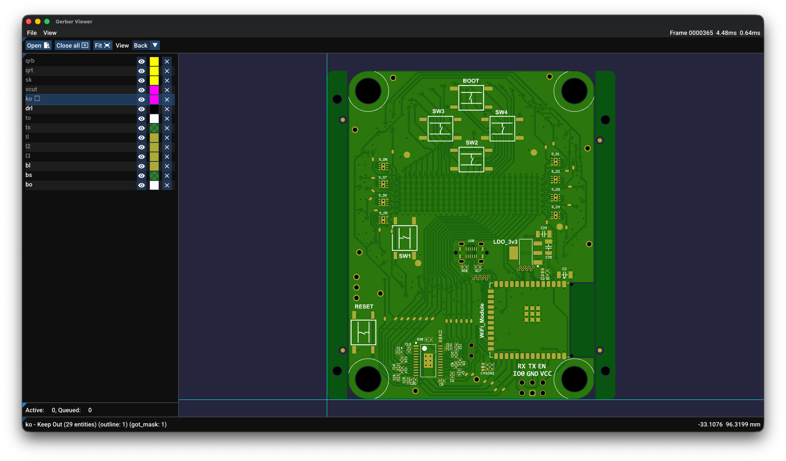

# Gerber Explorer

Based on GerbV originally. This is a work in progress.



## TODO

There's a lot left to do.

## Build Instructions

### Install CMake and Ninja

- Get CMake from [here](https://cmake.org/download/)
- Get Ninja from [here](https://ninja-build.org/)

Or you can use `make` instead of `ninja`, in which case... install that.

### Windows/MSVC

#### Get to a 64 bit developer Command Prompt

One way to do this is open a Command Prompt and enter this (assuming your Visual Studio installation is in the default location).

```
"C:\Program Files\Microsoft Visual Studio\2022\Community\VC\Auxiliary\Build\vcvarsall.bat" x64
```

#### Clone the repository

```
> cd <your dev folder>
> git clone https://github.com/cskilbeck/gerber_explorer
> cd gerber_explorer
```

#### Build it

```
> cmake -G Ninja -B build
> cmake --build build
```

The executable should be in `build/gerber_explorer/gerber_explorer.exe`

#### Alternatively, if you want to use Visual Studio

```
> cmake -B build
```

Then open Visual Studio and load the `.sln` file in the `build` folder.

#### Other targets

I've tested building it with these toolchains on Windows via CLion.

- MSVC
- clang-cl
- gcc

### MacOS

Open a terminal, and make sure you have the XCode Command Line tools installed:

```
$ xcode-select --install
```

Then, to build it:

```
$ cd <your dev folder>
$ git clone https://github.com/cskilbeck/gerber_explorer
$ cd gerber_explorer
$ cmake -G Ninja -B build
$ cmake --build build
```

The result should be in `build/gerber_explorer`

Presumably there's a way to get CMake to generate an XCode project but I haven't looked into that.

### Linux

#### Prerequisites

You need CMake 3.24+, Ninja (or Make), and a C++23-capable compiler (GCC 13+ or Clang 16+).

**Debian/Ubuntu:**

```
$ sudo apt install build-essential cmake ninja-build \
    libgl-dev libx11-dev libxrandr-dev libxinerama-dev \
    libxcursor-dev libxi-dev libxkbcommon-dev \
    libwayland-dev libgtk-3-dev pkg-config
```

**Fedora:**

```
$ sudo dnf install gcc-c++ cmake ninja-build \
    mesa-libGL-devel libX11-devel libXrandr-devel libXinerama-devel \
    libXcursor-devel libXi-devel libxkbcommon-devel \
    wayland-devel gtk3-devel pkg-config
```

**Arch:**

```
$ sudo pacman -S base-devel cmake ninja \
    mesa libx11 libxrandr libxinerama libxcursor libxi \
    libxkbcommon wayland gtk3 pkg-config
```

These provide: OpenGL (required by the renderer), X11/Wayland headers (required by GLFW), and GTK3 (required by the native file dialog). All other dependencies are fetched automatically by CMake via FetchContent.

#### Clone and build

```
$ git clone https://github.com/cskilbeck/gerber_explorer
$ cd gerber_explorer
$ cmake -G Ninja -B build
$ cmake --build build
```

The executable will be at `build/gerber_explorer/gerber_explorer`.
