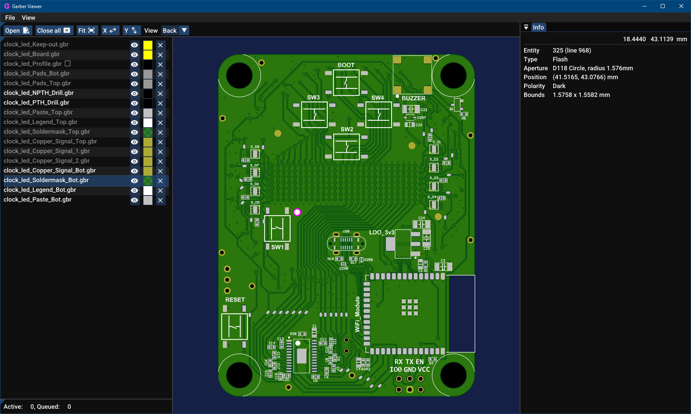

# Gerber Explorer

Based on GerbV originally. This is a work in progress.



## TODO

There's a lot left to do.

## Build Instructions

### Install CMake and Ninja

- Get CMake from [here](https://cmake.org/download/)
- Get Ninja from [here](https://ninja-build.org/)

Or you can use `make` instead of `ninja`, in which case... install that.

### Windows/MSVC

#### Get to a 64 bit developer Command Prompt

One way to do this is open a Command Prompt and enter this (assuming your Visual Studio installation is in the default location).

```
"C:\Program Files\Microsoft Visual Studio\2022\Community\VC\Auxiliary\Build\vcvarsall.bat" x64
```

#### Clone the repository

```
> cd <your dev folder>
> git clone https://github.com/cskilbeck/gerber_explorer
> cd gerber_explorer
```

#### Build it

```
> cmake -G Ninja -B build
> cmake --build build
```

The executable should be in `build/gerber_explorer/gerber_explorer.exe`

#### Alternatively, if you want to use Visual Studio

```
> cmake -B build
```

Then open Visual Studio and load the `.sln` file in the `build` folder.

#### Other targets

I've tested building it with these toolchains on Windows via CLion.

- MSVC
- clang-cl
- gcc

### MacOS

Open a terminal, and make sure you have the XCode Command Line tools installed:

```
$ xcode-select --install
```

LLVM (version 21 or later) is also required, one way to get this is via Homebrew:

```
brew install llvm@21
```

Then, to build it:

```
$ cd <your dev folder>
$ git clone https://github.com/cskilbeck/gerber_explorer
$ cd gerber_explorer
$ cmake -G Ninja -B build
$ cmake --build build
```

The result should be in `build/gerber_explorer`

Note that debug builds create a bare executable, release builds create an app package.

### Linux

#### Prerequisites

You need CMake 3.24+, Ninja (or Make), and a C++23-capable compiler (GCC 13+ or Clang 21+).

The project uses SDL3 (built statically from source via FetchContent) for windowing and the GPU backend, which targets Vulkan on Linux. The native file dialog uses GTK3. All other dependencies are fetched automatically by CMake.

**Debian/Ubuntu** (tested on Ubuntu 24.04):

```
$ sudo apt install build-essential cmake ninja-build pkg-config \
    libx11-dev libxext-dev libxrandr-dev libxcursor-dev \
    libxi-dev libxfixes-dev libxss-dev \
    libxkbcommon-dev libxkbcommon-x11-dev \
    libwayland-dev wayland-protocols libdecor-0-dev \
    libdrm-dev libgbm-dev libudev-dev libdbus-1-dev libibus-1.0-dev \
    libasound2-dev libpulse-dev libpipewire-0.3-dev \
    libgtk-3-dev \
    libvulkan-dev mesa-vulkan-drivers
```

`vulkan-tools` (provides `vulkaninfo`) is optional but useful to confirm Vulkan is working.

**Fedora** (untested — package names translated from the Ubuntu list):

```
$ sudo dnf install gcc-c++ cmake ninja-build pkgconf-pkg-config \
    libX11-devel libXext-devel libXrandr-devel libXcursor-devel \
    libXi-devel libXfixes-devel libXScrnSaver-devel \
    libxkbcommon-devel libxkbcommon-x11-devel \
    wayland-devel wayland-protocols-devel libdecor-devel \
    libdrm-devel mesa-libgbm-devel systemd-devel dbus-devel ibus-devel \
    alsa-lib-devel pulseaudio-libs-devel pipewire-devel \
    gtk3-devel \
    vulkan-loader-devel vulkan-headers mesa-vulkan-drivers
```

**Arch** (untested — package names translated from the Ubuntu list):

```
$ sudo pacman -S base-devel cmake ninja pkgconf \
    libx11 libxext libxrandr libxcursor libxi libxfixes libxss \
    libxkbcommon \
    wayland wayland-protocols libdecor \
    libdrm libudev0-shim dbus libibus \
    alsa-lib libpulse pipewire \
    gtk3 \
    vulkan-icd-loader vulkan-headers vulkan-mesa-layers
```

#### Clone and build

```
$ git clone https://github.com/cskilbeck/gerber_explorer
$ cd gerber_explorer
$ cmake -G Ninja -B build
$ cmake --build build
```

The executable will be at `build/gerber_explorer/gerber_explorer`.

The first configure pulls down ~10 dependencies via CMake FetchContent (SDL3, Dear ImGui, cpptrace, libtess2, Clipper2, nativefiledialog-extended, nlohmann/json, stb, DirectXMath, and a prebuilt DXC binary used at build time to compile HLSL shaders to SPIR-V). It takes a few minutes the first time; subsequent builds are incremental.
